# Feature 88 - Implementation plan

Design and rationale live in [problem.md](problem.md). This file lists the
ordered, committable steps only. Steps do not repeat context already in
`problem.md`; they link to it.

## Index

- [Conventions](#conventions)
- [Section A - Shared N-level primitive (Common.PowerShell)](#section-a---shared-n-level-primitive-commonpowershell)
  - [A1. Nested-tree core model + accumulation](#a1-nested-tree-core-model--accumulation)
  - [A2. JSON export / import (cross-process handoff)](#a2-json-export--import-cross-process-handoff)
  - [A3. N-level console report renderer](#a3-n-level-console-report-renderer)
  - [A4. Re-express the 2-level verbs as shims](#a4-re-express-the-2-level-verbs-as-shims)
  - [A5. Version gate + consumer pins](#a5-version-gate--consumer-pins)
- [Section B - Provisioner consumes the shared module (Vm-Provisioner)](#section-b---provisioner-consumes-the-shared-module-vm-provisioner)
  - [B1. Consume the shared module (drop local timing copies)](#b1-consume-the-shared-module-drop-local-timing-copies)
- [Section C - E2E orchestration + merge + report (Infrastructure-E2E)](#section-c---e2e-orchestration--merge--report-infrastructure-e2e)
  - [C1. Instrument the runner-lifecycle tree](#c1-instrument-the-runner-lifecycle-tree)
  - [C2. Graft child-process trees under their parts](#c2-graft-child-process-trees-under-their-parts)
  - [C3. Emit report + rolling JSON artifact with retention](#c3-emit-report--rolling-json-artifact-with-retention)
- [Section D - Child-process depth emitters](#section-d---child-process-depth-emitters)
  - [D1-A. Default-context export shim + version gate (Common.PowerShell)](#d1-a-default-context-export-shim--version-gate-commonpowershell)
  - [D1-B. Export the provisioner tree on the env-var opt-in (Vm-Provisioner)](#d1-b-export-the-provisioner-tree-on-the-env-var-opt-in-vm-provisioner)
  - [D2. Instrument + export create/remove-users.ps1 (Vm-Users)](#d2-instrument--export-createremove-usersps1-vm-users)
  - [D2-B. Self-guarding opt-in export shim + consumer adoption (Common.PowerShell)](#d2-b-self-guarding-opt-in-export-shim--consumer-adoption-commonpowershell)
  - [D2-C. Extract the whole user-reconcile orchestration (Vm-Users)](#d2-c-extract-the-whole-user-reconcile-orchestration-vm-users)
  - [D3. Instrument + export register/deregister-runners.ps1 (GitHubRunners)](#d3-instrument--export-registerderegister-runnersps1-githubrunners)
  - [D3-B. Extract the shared runner-reconcile front matter (GitHubRunners)](#d3-b-extract-the-shared-runner-reconcile-front-matter-githubrunners)
- [Section E - Bash depth tier (last)](#section-e---bash-depth-tier-last)
  - [E1. Bash timing emitter + wire into the bash flows](#e1-bash-timing-emitter--wire-into-the-bash-flows)
  - [E2. Toolchains ansible shell-out gets its own child span (Infrastructure-E2E)](#e2-toolchains-ansible-shell-out-gets-its-own-child-span-infrastructure-e2e)
  - [E3. Bridge the opt-in across the WSL boundary (Infrastructure-E2E)](#e3-bridge-the-opt-in-across-the-wsl-boundary-infrastructure-e2e)
- [Cross-process data flow (whole feature)](#cross-process-data-flow-whole-feature)

## Conventions

- Each step is one commit. Tests listed under a step ship in the same
  commit. Lint (`lint-shell` / `lint-yaml` / PSScriptAnalyzer) and the
  relevant test suite must be green before the step is considered done.
- New public functions get a neutral, framework-scoped verb-noun name; the
  final names below are proposals settled during execution.
- Manifest wiring ships with the function. A step that adds a
  `Common.PowerShell/Public/` function also dot-sources it in the psm1 and
  lists it (alphabetically) in both `FunctionsToExport` and
  `Export-ModuleMember`, because the shared `Module.Tests` fails on any
  un-exported `Public\*.ps1`. The `ModuleVersion` bump, `CHANGELOG`
  promotion, and consumer `RequiredModules` pins are a separate release
  gate handled once in A5.
- Coverage is collected on every PowerShell test run and reported in
  totality and per project, per CLAUDE.md.
- Each step updates the README sections it earns, in the same commit that
  introduces the surface. Documentation is part of every step, never a
  separate terminal docs pass.

## Section A - Shared N-level primitive (Common.PowerShell)

The generalisation of the existing 2-level framework (see
[Current state](problem.md#current-state)) into an arbitrary-depth nested
tree, living in `Common.PowerShell/Common.PowerShell/Public/`.

### A1. Nested-tree core model + accumulation

**What.** Add the in-memory model and the primary timing verb:

- `New-TimingSpanTree -RootName <string>` - creates a root node and returns
  a context object that owns the tree + a current-node stack.
- `Measure-TimingSpan -Tree <ctx> -Name <string> -Action <sb>` - find-or-
  create a child named `Name` under the current node, push it, time
  `-Action`, accumulate `ElapsedMs`, set terminal `Status`
  (`OK`/`Failed`, sticky-Failed), pop. Exceptions propagate (observe, do
  not swallow) exactly like `Invoke-WithPhaseTimer` today.
- `Add-TimingSpanDuration -Tree <ctx> -Name <string> -ElapsedMs <int64>
  [-Failed]` - the measure-less primitive for callers that already have an
  elapsed value (mirrors `Add-SubStepDuration`).
- `Initialize-TimingSpanTree -Tree <ctx> -Skeleton <nested hashtable[]>` -
  optional pre-declaration so branches that never run render as `SKIPPED`.

Node shape: `{ Order; Name; Status; ElapsedMs; Source; Children }`.
`Source` is an optional tag (e.g. `provision.ps1`) used later by the merge
step. Accumulation is by name-within-parent so a step run once per VM sums,
preserving today's semantics.

The four verbs live under `Common.PowerShell/Public/Timing/` over three
private helpers in `Private/Timing/` (`Resolve-TimingSpanChildNode` mints
nodes and assigns `Order`, `Add-TimingSpanNodeElapsed` accumulates + sets
sticky status, `Add-TimingSpanSkeletonBranch` walks the skeleton) so the
mint / accumulate / declare mechanics have one implementation each. Per the
manifest-wiring convention, this step also exports the four verbs; the
version gate is A5.

**Why.** Arbitrary depth is the core requirement
([What we want](problem.md#what-we-want)); everything else builds on this
model. A context object (not a `$script:` global) lets the E2E parent and
an imported child tree coexist in one process without clobbering shared
state - the current global-variable design cannot.

**Tests** (`Common.PowerShell.Tests`, unit):
- span nesting to 3+ levels places nodes under the correct parent;
- repeated `Measure-TimingSpan` of the same name accumulates elapsed and
  keeps one node;
- a throwing action records partial elapsed, sets `Failed`, and rethrows;
- sticky-Failed: a later success against a Failed node does not clear it;
- pre-declared skeleton branch left un-run stays `NotStarted`;
- `Order` reflects first-contact declaration order across mixed depths.

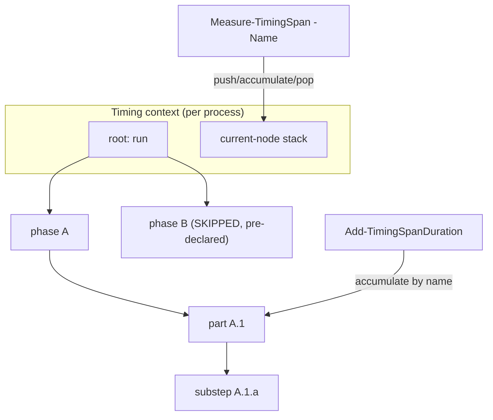

### A2. JSON export / import (cross-process handoff)

**What.** Add:

- `Export-TimingSpanTree -Tree <ctx> -Path <file>` - serialise the tree to
  the versioned nested-JSON shape from
  [Artifact shape decision](problem.md#artifact-shape-decision)
  (`schema: e2e-timing/v1`, `root.children[]`, invariant-culture numbers).
- `Import-TimingSpanTree -Path <file>` - parse a child's export back into a
  node subtree, tolerating a missing or malformed file (returns `$null`
  with a warning; never throws).

**Why.** The process boundary is the central problem
([Motivation](problem.md#motivation)); a serialised tree is how a child
hands its timings to the parent. Import must be defensive so a crashed
child never fails the parent's own report.

**Tests** (unit): round-trip (export then import equals original within
numeric tolerance); schema-version field present; malformed JSON -> `$null`
+ warning, no throw; missing file -> `$null`, no throw.

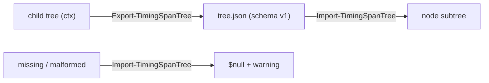

### A3. N-level console report renderer

**What.** `Write-TimingSpanReport -Tree <ctx|node>` - depth-indented
report: per node its `[OK]/[FAILED]/[SKIPPED]` tag, elapsed (invariant
`F2` seconds), and percent-of-parent; a total line for the root. Same
`DarkGreen` single-colour block and column-alignment approach as the
existing `Write-PhaseTimingReport` so it reads consistently.

**Why.** The console report is the primary deliverable
([What we want](problem.md#what-we-want)); it must handle arbitrary depth
and the merged (multi-source) tree, which the 2-level renderer cannot.

**Tests** (unit): a hand-built 4-level tree renders with correct indent and
tags; `%`-of-parent sums sensibly; `SKIPPED`/`FAILED` rows show the dash /
partial elapsed; total counts root only (no double-count).

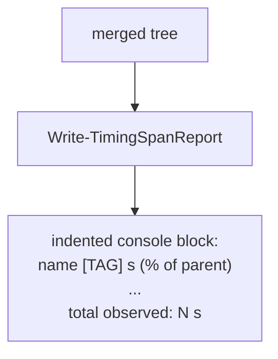

### A4. Re-express the 2-level verbs as shims

**What.** The five 2-level verbs (`Initialize-PhaseTimings`,
`Invoke-WithPhaseTimer`, `Invoke-WithSubStepTimer`, `Add-SubStepDuration`,
`Write-PhaseTimingReport`) live in `Common.PowerShell/Public/Timing/` as thin
wrappers over the A1-A3 core, sharing one module-scoped default context
(`$script:DefaultPhaseTimingTree`) so call sites keep their exact signatures
(no `-Tree` argument):

- `Initialize-PhaseTimings -Phases` mints a fresh default context
  (`New-TimingSpanTree`) and pre-declares it (`Initialize-TimingSpanTree`),
  translating each `@{ Name; SubSteps }` entry into a skeleton `Children`
  branch; re-init clears prior state. It keeps the legacy validation messages
  (empty name / empty sub-step naming the parent).
- `Invoke-WithPhaseTimer -Name` guards the "phase pre-declared" contract
  (throws on an unknown top-level name) then delegates to a depth-1
  `Measure-TimingSpan` on the default context.
- `Invoke-WithSubStepTimer -Parent P -Name` / `Add-SubStepDuration -Parent P`
  resolve the sub-step under the phase node named `P` (not the current-node
  stack), so the legacy "any declared phase is the parent" contract holds
  regardless of call nesting; `Invoke-WithSubStepTimer` is the stopwatch
  wrapper over the measure-less `Add-SubStepDuration`.
- `Write-PhaseTimingReport` renders the default context's 2-level tree in the
  legacy presentation (fixed `=== Provisioning timing report ===` banner, no
  percent column, top-level-only total). It is a distinct renderer, not a call
  to `Write-TimingSpanReport`, because the output must stay byte-identical.

The elapsed-column formatter and the status-tag map are the single authority
for both renderers, extracted to `Private/Timing/Format-TimingSpanElapsed` and
`Private/Timing/Get-TimingSpanStatusTag`.

**Why.** Behaviour-preserving migration
([Constraints](problem.md#constraints-and-non-goals)): `provision.ps1` and
its Pester suite must not change behaviour, and B1 requires the same console
report. Shimming, rather than rewriting call sites, keeps this step small and
low-risk and gives one framework under the hood.

**Tests** (`Common.PowerShell.Tests`, unit): the ported `PhaseTimings` tests -
declaration/order, undeclared-phase and not-initialised throws, sub-step
accumulation, sticky-`Failed`, top-level-only total, and SKIPPED rendering;
structural checks assert against the default context's tree (the tree-model
successor of the old flat `$script:PhaseTimings` list). A 2-level tree built
via the compat verbs renders byte-for-byte as the pre-generalisation report
(pinned-duration snapshot).

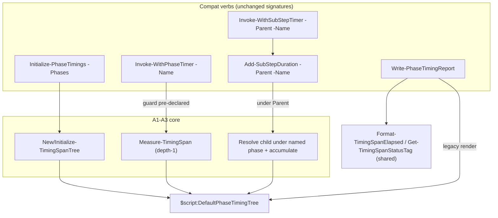

### A5. Version gate + consumer pins

**What.** The per-function manifest exports already ship with A1-A4 (see the
manifest-wiring convention), so this step is the release gate: bump
`ModuleVersion`, promote the accumulated `[Unreleased]` `CHANGELOG` entry to
the new version + date, and update the `RequiredModules` pins in every
consumer that imports the new surface. See the export-intersection and
version-bump gotchas noted in memory. No current cross-repo consumer imports
the new timing surface (the Section B/C/D consumers are wired in later steps
and bump their own pin as they start consuming), so the pin update here is a
no-op; the version + CHANGELOG promotion is what satisfies the release gate.

**Why.** The release CI gate (`check-version-is-new` + assert-changelog) in
`release.yml` / `release-tail.yml` fails a `ModuleVersion` bump without a
matching CHANGELOG promotion, and consumers pinning an older version cannot
resolve the new functions
([Constraints](problem.md#constraints-and-non-goals)).

**Tests**: assert-changelog-version gate green; a smoke import in a clean
session resolves the new functions against the pinned version. (`Module.Tests`
intersection is already green from A1-A4.)

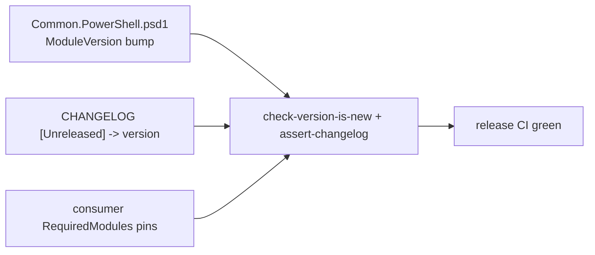

## Section B - Provisioner consumes the shared module (Vm-Provisioner)

The provisioner's SSOT migration onto the shared module. Independent of the
E2E work and the first live exercise of the A4 shims, so it lands ahead of
Section C ([sequencing rationale](problem.md#resolved-decisions)).

### B1. Consume the shared module (drop local timing copies)

**What.** Replace the five `up/timing/*` dot-sources in `provision.ps1`
with the `Common.PowerShell` import (already present) and delete the local
timing files, making the shared module the single source of truth. Raise the
provisioner's `Common.PowerShell` minimum-version floor to `9.1.0` (the
release A5 shipped the compat shims in) so the import resolves the shim
surface `provision.ps1` calls.

**Why.** SSOT: two copies of the framework would drift. `provision.ps1`
already imports `Common.PowerShell`, so this is a delete + path change. It is
also the first live exercise of the A4 shims, confirming the re-expressed
2-level verbs behave byte-for-byte in a real consumer.

**Tests**: provisioner PowerShell suite green (timing behaviour unchanged);
a provision dry-run still prints the same phase report.

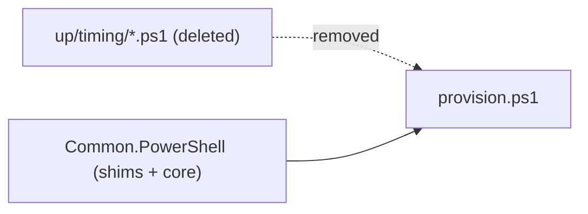

## Section C - E2E orchestration + merge + report (Infrastructure-E2E)

Built ahead of the Section D emitters. The graft is defensive, so the report
ships complete with each shell-out part as a single opaque span and the
Section D emitters later deepen parts that already render. This gets the
deliverable - the report and rolling artifact - out first and validates the
schema against a real orchestration
([sequencing rationale](problem.md#resolved-decisions)).

### C1. Instrument the runner-lifecycle tree

**What.** In `Invoke-RunnerLifecycleTest` and the functions it calls
(`Invoke-RunnerLifecycleSetup`, `Invoke-VmUsersSetup`, the phase 2/3 and
assertion helpers, teardown), create the run context and wrap each phase
and part with `Measure-TimingSpan`. Thread the context (not a global) down
the call tree. Parts that shell out (provision/register/users) are wrapped
as one span here; C2 grafts their internals once the Section D emitters
export them.

**Why.** This produces the phase/part breakdown that is the whole point
([Summary](problem.md#summary)).

**Tests** (unit, with the shell-outs mocked): a full mocked run yields a
tree whose phase and part node names match the expected orchestration
shape; a mid-run failure still yields a tree up to the failure with the
failing span marked `Failed`.

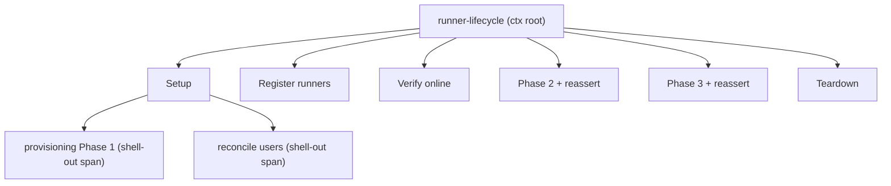

### C2. Graft child-process trees under their parts

**What.** For each shell-out part, set `TIMING_TREE_OUTPUT_PATH` to a fresh
per-invocation temp file before the call, and after it returns
`Import-TimingSpanTree` and attach the imported subtree as the children of
that part's span; delete the temp file. Missing/corrupt child JSON leaves
the part timed with no children (graceful, per A2) - which is exactly the
state until the Section D emitters land, so this step is correct on its own
and each part deepens as its emitter ships.

**Why.** This is the "full depth" join
([What we want](problem.md#what-we-want)) - it turns an opaque 8-minute
"provisioning Phase 1" into its VM-boot / JDK-install / wait-for-SSH
breakdown.

**Tests** (unit): a stubbed child export is grafted under the correct part
node; absent child file -> part has zero children and no error; the temp
file is cleaned up.

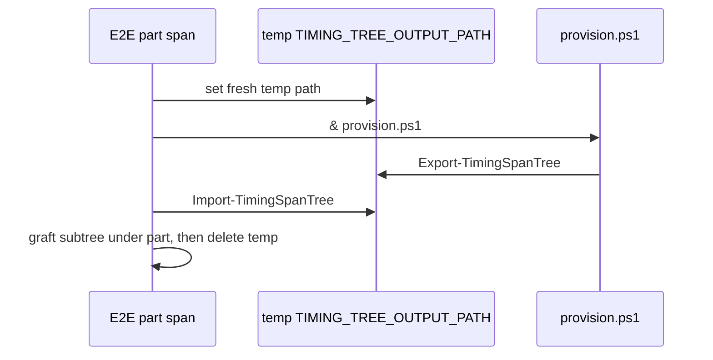

### C3. Emit report + rolling JSON artifact with retention

**What.** In the run's outer `finally` (so it fires on success, failure,
and best-effort-cleanup paths): call `Write-TimingSpanReport` for the
console block, then `Export-TimingSpanTree` to
`<diagnostics-root>/timing/<timestamp>.json`, then
`Limit-RetainedItem -Directory <...>/timing -Filter '*.json' -MaxItems N
-FileOnly` to prune old artifacts. See
[artifact location](problem.md#resolved-decisions).

**Why.** Delivers the on-failure-too report and the rolling machine-
readable artifact ([What we want](problem.md#what-we-want)); retention
reuses the existing `Limit-RetainedItem` rather than a new pruner.

**Tests** (unit): report emitted on both success and failure paths; JSON
artifact written under `timing/`; with `MaxItems` exceeded, oldest files
pruned and newest kept.

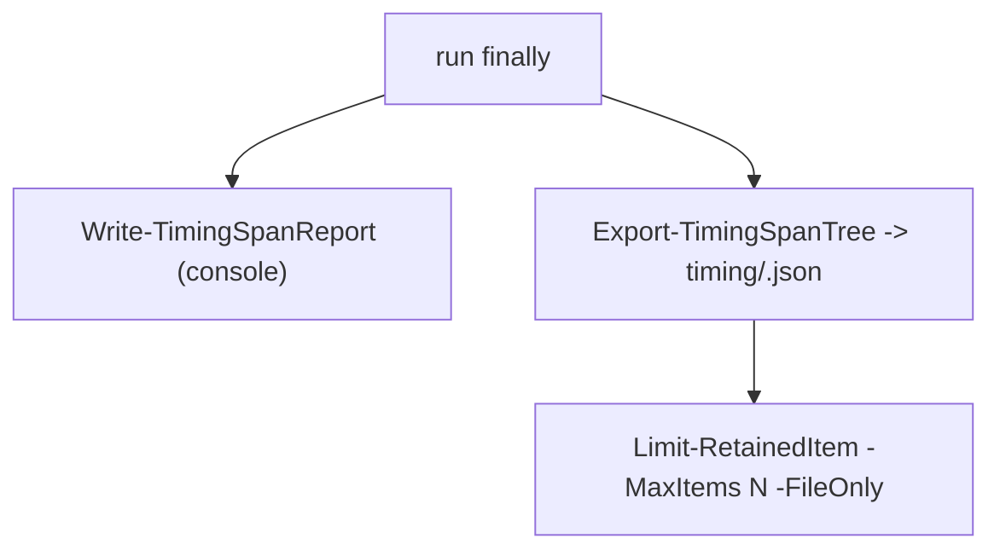

## Section D - Child-process depth emitters

These populate the child exports that Section C's graft (C2) already imports,
turning each opaque shell-out part into its internal breakdown. Each is the
child half of the neutral `TIMING_TREE_OUTPUT_PATH` opt-in and stays
test-agnostic (production stays E2E-unaware, per memory). Each consuming step
also bumps its repo's `Common.PowerShell` minimum-version pin to the surface
it needs, per the A5 convention.

The provisioner and the runner scripts drive timing through the 2-level compat
shims (A4), whose tree lives in the module-private default context - there is
no exported way for a shim consumer to serialise it. D1-A adds that missing
piece (an `Export-PhaseTimingTree` shim over the default context) as a
Common.PowerShell surface + release gate; the shim consumers (D1-B, D3) then
call it behind the env-var opt-in and pin the version that shipped it.

### D1-A. Default-context export shim + version gate (Common.PowerShell)

**What.** Add `Export-PhaseTimingTree -Path <file>` to
`Common.PowerShell/Public/Timing/` - a 2-level compat shim that serialises the
module-private default context (`$script:DefaultPhaseTimingTree`, the tree the
A4 shims build) by delegating to the core `Export-TimingSpanTree -Tree`. It is
the export counterpart of `Write-PhaseTimingReport`: same no-`-Tree` surface,
same default-context read, and the same "return silently when the context was
never initialised" guard. Per the manifest-wiring convention, dot-source it in
the psm1 and list it alphabetically in both `FunctionsToExport` and
`Export-ModuleMember`. Then run the release gate exactly as A5: bump
`ModuleVersion`, promote the `[Unreleased]` CHANGELOG entry to the new version +
date. No cross-repo pin moves here (the consumers pin as they start calling it,
in D1-B and D3).

**Why.** A shim consumer (`provision.ps1`, `register-runners.ps1`) has no handle
to the default context - it is private to the module scope, reachable today only
by `Write-PhaseTimingReport` from inside the module. Exporting that context on
the `TIMING_TREE_OUTPUT_PATH` opt-in (D1-B, D3) therefore needs a shim member
that reads it, mirroring the report verb. Keeping the core `Export-TimingSpanTree`
mandatory-`-Tree` preserves the clean context-explicit core / default-context
shim split the module was built on (see A4); overloading the core verb with a
hidden-global fallback would blur that line and turn a forgotten `-Tree` into
silent action-at-a-distance instead of a binding error.

**Tests** (`Common.PowerShell.Tests`, unit): with a default context initialised
and populated (via the shims), `Export-PhaseTimingTree -Path` writes a
schema-valid JSON whose tree matches the default context (round-trips via
`Import-TimingSpanTree`); with no context initialised, it writes nothing and
does not throw (parity with `Write-PhaseTimingReport`'s null-guard).
assert-changelog-version gate green; `Module.Tests` export-intersection green
for the new verb.

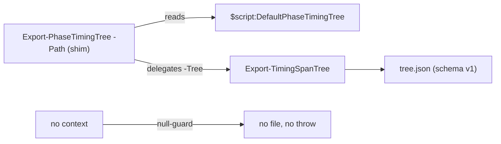

### D1-B. Export the provisioner tree on the env-var opt-in (Vm-Provisioner)

**What.** At the end of `provision.ps1`'s outer `try/finally` (where
`Write-PhaseTimingReport` already runs), when
`$env:TIMING_TREE_OUTPUT_PATH` is set, also call `Export-PhaseTimingTree` (the
D1-A shim) to that path - on success AND failure. The early `Wsl2NotReady`
reboot exit already prints the report before `exit 0`; extend that path the same
way so a partial run still emits its artifact when the opt-in is set. When unset,
behaviour is unchanged (console report only). Neutral variable name; the script
does not know who consumes it. Raise the provisioner's `Common.PowerShell`
minimum-version floor to the release D1-A shipped in, so the import resolves the
new shim. See [cross-process handoff](problem.md#resolved-decisions).

**Why.** This is the child half of the process-boundary bridge whose parent
half (C2) already imports and grafts; it is what finally populates the
provisioning part's subtree. Kept test-agnostic (production stays E2E-unaware,
per memory).

**Tests** (unit): with the env var set, provision writes a schema-valid
JSON at the path; the failure path still writes; with the env var unset, no
file is written and the console report is unchanged.

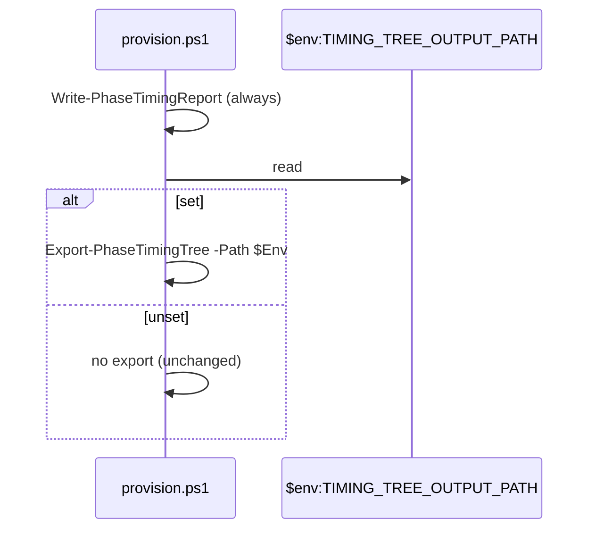

### D2. Instrument + export create/remove-users.ps1 (Vm-Users)

**What.** Wrap the meaningful stages of `create-users.ps1` (and its
`remove-users.ps1` counterpart) in `Invoke-WithPhaseTimer`/
`Invoke-WithSubStepTimer` (or the core verbs) via the shared module - read
provisioner config, resolve router IP, read users config, match + SSH-probe
targets, per-VM group / sudoers / user reconciliation - and export on the same
`TIMING_TREE_OUTPUT_PATH` opt-in as D1-B, via the D1-A `Export-PhaseTimingTree`
shim, pinning the release that shipped it. Test-agnostic (production stays
E2E-unaware, per memory).

**Why.** The `reconcile users` E2E part (C1) is a PowerShell shell-out to
`create-users.ps1` - the third child of the same tier as provision (D1-B) and
runners (D3), not the bash `create-users.sh` (that is the Ansible path, timed
by E1). Without this the users part stays a single opaque span after C2 grafts
its empty subtree ([What we want](problem.md#what-we-want)).

**Tests** (unit): stages recorded under the expected names; export written
when the env var is set; unset path unchanged.

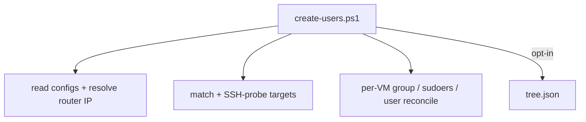

### D2-B. Self-guarding opt-in export shim + consumer adoption (Common.PowerShell)

**What.** The child emitters all hand-write the same four-line opt-in guard -
`if ($env:TIMING_TREE_OUTPUT_PATH) { Export-PhaseTimingTree -Path
$env:TIMING_TREE_OUTPUT_PATH }` - once each in `create-users.ps1` and
`remove-users.ps1` (D2), and twice in `provision.ps1` (the outer `finally` and
the `Wsl2NotReady` reboot-exit, D1-B). Add a self-guarding shim
`Export-PhaseTimingTreeIfRequested` to `Common.PowerShell/Public/Timing/`: a
no-`-Tree` default-context verb that reads the neutral output-path environment
variable (default `TIMING_TREE_OUTPUT_PATH`, overridable via `-EnvVariableName`)
and, when it is set, delegates to `Export-PhaseTimingTree`; when unset - or when
the default context was never initialised - it no-ops. Wire it per the manifest
convention (psm1 dot-source + alphabetical entry in both `FunctionsToExport` and
`Export-ModuleMember`) and run the release gate exactly as D1-A: bump
`ModuleVersion`, promote the `[Unreleased]` CHANGELOG entry.

Then collapse every current call site to a single
`Export-PhaseTimingTreeIfRequested` - `create-users.ps1` and `remove-users.ps1`
(D2) and both `provision.ps1` sites (finally + reboot-exit, D1-B) - and raise
each consumer's `Common.PowerShell` floor to the release this ships. D2-C then
carries the one shim call into the extracted orchestrator; D3 uses the shim from
the start; so neither hand-writes the guard.

**Why.** The env-guard idiom is the last repeated timing fragment across the
child emitters, and it hard-codes the `TIMING_TREE_OUTPUT_PATH` contract name at
each site - a typo in one consumer silently disables its export with no error.
Centralising the guard and the env-var name in one shim makes the opt-in
contract single-sourced (the name lives in exactly one place) and turns each
call site into one intention-revealing call. Keeping the core
`Export-PhaseTimingTree` mandatory-`-Path` preserves the context-explicit
core / opt-in-aware shim split the module was built on (see A4 and D1-A);
the env-var read lives only in the shim. Sequenced before D2-C (right after D2)
so the shim is already in place when D2-C collapses the two Vm-Users scripts -
the extracted orchestrator inherits the one shim call rather than a hand-written
guard that would then need swapping out.

**Tests** (`Common.PowerShell.Tests`, unit): env set + populated default context
-> `Export-PhaseTimingTreeIfRequested` writes schema-valid JSON that round-trips
via `Import-TimingSpanTree`; env unset -> no file, no throw; context never
initialised -> no file, no throw (null-guard parity with
`Write-PhaseTimingReport`); a custom `-EnvVariableName` is honoured.
assert-changelog-version gate green; `Module.Tests` export-intersection green for
the new verb. Consumer AST suites simplify: the `provision.ps1`,
`create-users.ps1`, and `remove-users.ps1` export checks drop the
`if ($env:...)` guard walk and instead assert a single unguarded
`Export-PhaseTimingTreeIfRequested` at each export site, plus the raised floor.

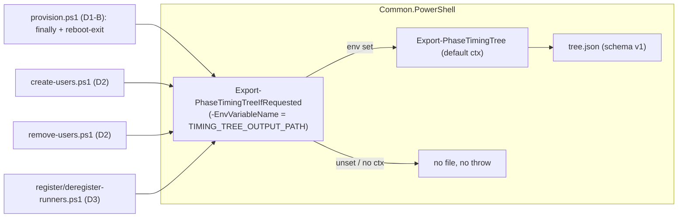

### D2-C. Extract the whole user-reconcile orchestration (Vm-Users)

**What.** After D2 and the D2-B shim adoption, `create-users.ps1` and
`remove-users.ps1` are ~80% identical (~226 verbatim lines): the timing
declaration, all three timed stages (read-configs + resolve-router-IP, match +
SSH-probe, and the per-VM SSH session loop with its `New-VmSshClientWithJump`
connect, `SshConnectionException` / `SocketException` handling, and `Dispose`
teardown), and the outer `finally` calling the D2-B
`Export-PhaseTimingTreeIfRequested` shim. Only three things genuinely differ: the
reconcile-helper dot-sources (`reconcile/up` vs `reconcile/down`), the final
phase label, and the single per-VM call (`Invoke-VmUserCreate` vs
`Invoke-VmUserRemove`).

Lift the *entire* orchestration into one shared helper under
`Infrastructure-Vm-Users/hyper-v/ubuntu/PowerShell/reconcile/common/` (e.g.
`Invoke-VmUserReconcileRun.ps1`) that takes `-SecretSuffix`, `-FinalPhaseName`,
and a `-PerVmAction` scriptblock (invoked per reachable VM with the open SSH
client, VM name, and users entry). The helper owns `Initialize-PhaseTimings`
(the two shared stage names plus the passed final name), the `try` running and
timing all three stages - the per-VM loop calls `& $PerVmAction` where the lone
reconcile/removal call used to be - and the `finally` shim call
(`Export-PhaseTimingTreeIfRequested`, from D2-B). The shared router-resolution /
probe / session / scope-threading rationale comments move to the helper so they
have one home, per the no-duplicate-comments rule.

Each entry script collapses to its bootstrap and one call: dot-source
`Install-ModuleDependencies`, dot-source its own `reconcile/{up,down}` helpers
and the shared orchestrator, then invoke `Invoke-VmUserReconcileRun` with its
final label and a `-PerVmAction` that calls `Invoke-VmUserCreate` (create) or
`Invoke-VmUserRemove` (remove). Nothing else remains duplicated between the two.

**Why.** SSOT: two verbatim copies of a multi-stage vault-read + router-
resolution + SSH-probe + session-lifecycle flow drift silently - a fix to one
(a probe timeout, a KVP-discovery tweak, a `Dispose`-ordering correction) is
easy to forget in the other, and D2's timing scaffolding widened the copied
region until duplication is the dominant cost of both files
([constraints](problem.md#constraints-and-non-goals): one framework, not
parallel copies). Extraction also creates a mockable function seam: the entry
scripts are AST-only tested because their top-level side effects cannot be
dot-sourced, but a helper function CAN be dot-sourced with `Get-Secret` /
`Test-VmSshPort` / `Get-VmKvpIpAddress` / `New-VmSshClientWithJump` mocked, so
the whole flow gains real behavioural coverage instead of structural checks. The
`$script:`-scope threading between timed stages (D2's child-scope workaround) is
then written and tested once. Sequenced after D2-B so the `finally` it
centralises already calls the shared shim.

**Tests** (`Infrastructure-Vm-Users`, unit): a new behavioural suite for the
orchestrator, dot-sourcing it with the boundary cmdlets mocked - matched vs
unmatched join, reachable vs unreachable probe, router-jump vs direct path,
suffix-carried secret names, `-PerVmAction` invoked once per reachable VM with
the right client/entry, session `Dispose` on both success and throw, and the
`finally` invoking `Export-PhaseTimingTreeIfRequested` on the success AND failure
paths (the env-var opt-in behaviour itself is owned by D2-B's
`Common.PowerShell` tests). The create/remove-users AST suites shrink to what the
thin entry scripts still own: each declares its `-FinalPhaseName` and a
`-PerVmAction` whose body calls its own `Invoke-VmUserCreate` /
`Invoke-VmUserRemove`, and carries no stale unsuffixed literals. Net coverage
rises (a formerly AST-only flow becomes unit-tested); the existing behavioural
tests under `reconcile/{up,down}/` are unaffected.

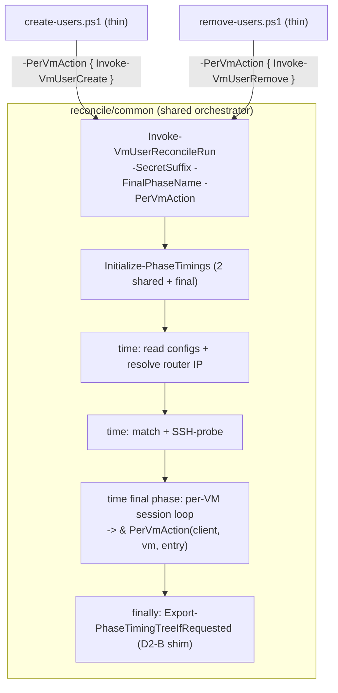

### D3. Instrument + export register/deregister-runners.ps1 (GitHubRunners)

**What.** Wrap the meaningful stages of `register-runners.ps1` (and
`deregister-runners.ps1`) in `Invoke-WithPhaseTimer`/`Invoke-WithSubStepTimer`
(or the core verbs) via the shared module, and export on the same
`TIMING_TREE_OUTPUT_PATH` opt-in as the other emitters - via the D2-B
`Export-PhaseTimingTreeIfRequested` self-guarding shim (so the guard is never
hand-written here), pinning the release that shipped it.

**Why.** Runner registration is a distinct phase of the E2E run and a
plausible time sink ([What we want](problem.md#what-we-want)); without this
it stays an opaque single part.

**Tests** (unit): stages recorded under the expected names; export written
when the env var is set; unset path unchanged.

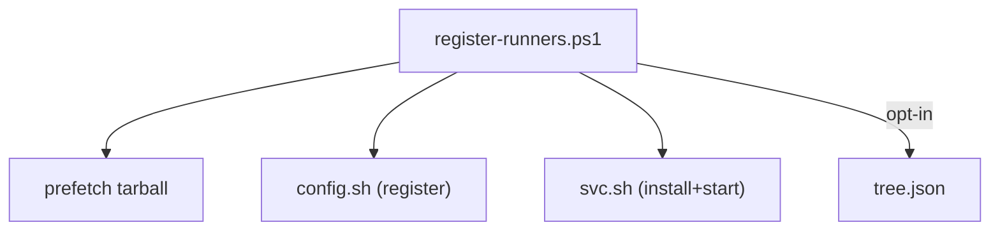

### D3-B. Extract the shared runner-reconcile front matter (GitHubRunners)

**What.** After D3, `register-runners.ps1` and `deregister-runners.ps1` share
their whole opening as near-verbatim copies - the two vault reads, the feature-53
router resolution, the phase-timing declaration, and the
`Export-PhaseTimingTreeIfRequested` finally - while diverging in the middle
(register: prefetch + install over a host file server; deregister: remove, with a
force-mode GitHub-API path for unreachable VMs). Lift the shared opening and the
timing envelope into a shared orchestrator `Invoke-RunnerReconcileRun` under
`registration/common/`, taking `-SecretSuffix`, `-OperationPhase` (the operation
stages that follow the shared one), and a `-Body` scriptblock (the divergent
middle, invoked with the router-stamped runner entries and the deploy passwords).
The orchestrator owns `Initialize-PhaseTimings` (the shared
`Read configs + resolve router IP` stage prepended to the caller's operation
phases), the timed shared stage itself, and the `finally`
`Export-PhaseTimingTreeIfRequested`. Each entry script collapses to its bootstrap
and one call passing its operation phases plus a `-Body` that wraps its stages in
`Invoke-WithPhaseTimer`.

Unlike D2-C's `-PerVmAction` seam, this is a coarser `-Body` seam: the two runner
directions diverge across their entire back half (register threads a host file
server + base URL through the per-VM loop; deregister branches
reachable/unreachable/force with no session for unreachable VMs), so only the
opening and the timing envelope are genuinely shared - not a per-VM call.

**Why.** SSOT: two verbatim copies of a two-vault read + router-resolution flow
drift silently ([constraints](problem.md#constraints-and-non-goals): one
framework, not parallel copies). D3's timing scaffolding widened the copied
region until duplication was the dominant cost of both files. Extraction also
creates a mockable function seam: the entry scripts are AST-only tested (their
top-level side effects cannot be dot-sourced), but the orchestrator CAN be
dot-sourced with `Read-GitHubRunnersConfig` / `Read-VmDeployPasswords` /
`Get-InfrastructureSecret` / `Get-VmKvpIpAddress` mocked, so the shared flow gains
real behavioural coverage instead of structural checks. Symmetric with
`Invoke-VmUserReconcileRun` (D2-C) in Infrastructure-Vm-Users; the router block is
now one copy per repo rather than one per entry script. Sequenced after D3, which
introduced the timing scaffolding it consolidates.

**Tests** (`Infrastructure-GitHubRunners`, unit): a new behavioural suite for the
orchestrator, dot-sourcing it with the vault/KVP boundary mocked -
suffix-stamped vault reads, the shared-then-operation phase declaration order,
router-stamp vs no-router topology, `-Body` invoked with the resolved context,
and the `finally` invoking `Export-PhaseTimingTreeIfRequested` on the success AND
failure paths (the env-var opt-in itself stays owned by D2-B's Common.PowerShell
tests). The register/deregister AST suites shrink to what the thin entry scripts
own: a single `Invoke-RunnerReconcileRun` call carrying the suffix and the
direction's operation phases, a `-Body` timing exactly those phases and wired to
the up/down verbs, no leaked shared-opening behaviour (no direct vault reads, no
router discovery, no bare `VmProvisionerConfig` literal, no own timing setup), and
the raised `Common.PowerShell` floor.

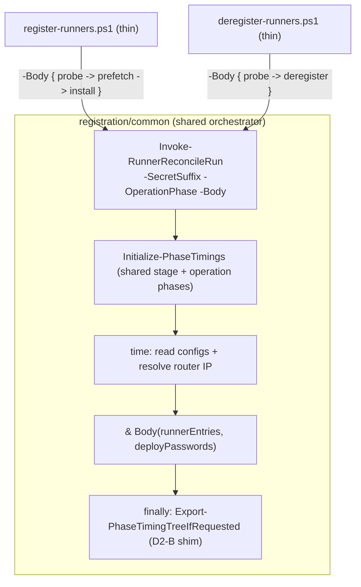

## Section E - Bash depth tier (last)

### E1. Bash timing emitter + wire into the bash flows

**What.** A small POSIX-sh emitter (in `Common-Automation/scripts`, next to
`log.sh`) that records named spans and writes the same nested JSON schema
to `TIMING_TREE_OUTPUT_PATH`. Wire it into `register-runners.sh`,
`provision-toolchains.sh`, and `create-users.sh` so the ansible-flow parts
gain sub-step depth instead of being a single part. Sequenced last per the
[PowerShell-first decision](problem.md#resolved-decisions).

**Why.** Completes full depth for the ansible flows; deferred so the
PowerShell breakdown ships first and proves the schema.

**Tests** (bats): emitter writes schema-valid JSON; spans nest; a flow with
the env var unset behaves exactly as today (no file, no output change).

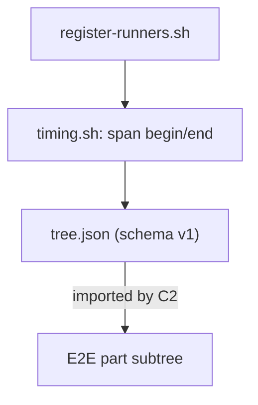

### E2. Toolchains ansible shell-out gets its own child span (Infrastructure-E2E)

**What.** The E2E `provisioning Phase 1` part (a
`Measure-ChildProcessTimingSpan` in `Invoke-VmUsersTest`) runs two children
that both honour the `TIMING_TREE_OUTPUT_PATH` opt-in: the baseline
`provision.ps1` (D1-B) and, under `ToolchainsFlow=ansible`, the bash
`provision-toolchains.sh` (E1). They share the part's single output path, so
the second writer overwrites the first. Thread the run's timing context into
`Invoke-VmProvisioningPhase1` and wrap its `Set-VmToolchainsForTest` call in a
nested `Measure-ChildProcessTimingSpan` (e.g. `provision toolchains`), giving
the toolchains child its own per-invocation path that grafts as a sub-span
under `provisioning Phase 1`. Audit the Phase 2 / 3 `Set-VmToolchainsForTest`
sites and apply the same wrap to any that run under a timed part beside a
co-resident exporting child.

Inert until E3: the bash variable still does not cross into WSL, so
`provision-toolchains.sh` exports nothing yet and the new `provision toolchains`
span renders with no children - a harmless structural addition that readies the
part for the bash subtree the moment E3 lands.

**Why.** `Measure-ChildProcessTimingSpan` models one exporting child per part
(one temp path). A part hosting two exporting children needs a distinct path per
child or one silently clobbers the other. Sequenced before the boundary bridge
(E3) so the split is in place before the bash export can reach the shared path -
no step ever ships the clobber.

**Tests** (`Infrastructure-E2E`, unit): a mocked `provisioning Phase 1` where
both `provision.ps1` and the toolchains shell-out write a stub tree yields
`provisioning Phase 1 -> { provision.ps1 spans } + { provision toolchains ->
toolchains spans }` with neither subtree lost; `ToolchainsFlow=custom-powershell`
(no bash child) leaves `provision toolchains` absent/empty and provision.ps1's
tree intact; the nested wrap restores the outer part's output path on both the
success and failure paths.

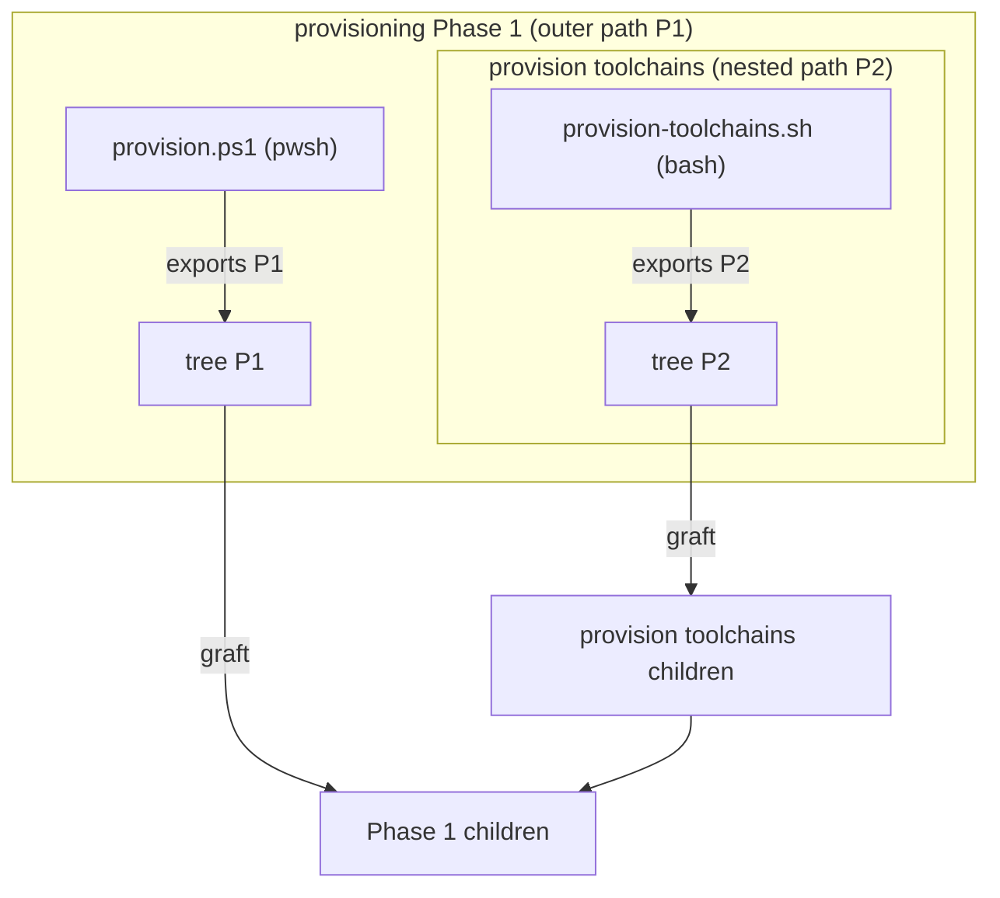

### E3. Bridge the opt-in across the WSL boundary (Infrastructure-E2E)

**What.** In `Measure-ChildProcessTimingSpan`, where it already sets and later
restores `$env:TIMING_TREE_OUTPUT_PATH`, also ensure `$env:WSLENV` carries
`TIMING_TREE_OUTPUT_PATH/p` for the duration of the action (append if absent,
guarded like the existing `GH_TOKEN/u` forwarding), saving the prior `WSLENV`
and restoring it in the same `finally`. The `/p` flag path-translates the
Windows temp path (`GetTempPath`, under `C:`) to `/mnt/c/...`, so the bash child
writes the same file the parent then imports. When the opt-in is unset nothing
is added, so a normal run is unchanged.

**Why.** A Windows environment variable is invisible inside `wsl -- ...` unless
named in `WSLENV`, and a path value is unusable there without `/p`
([cross-process handoff](problem.md#resolved-decisions)). This is the missing
link that makes the E1 emitters actually reach: `register-runners.sh` and
`create-users.sh` (single-child parts) begin exporting into the graft
immediately, and `provision-toolchains.sh` lands in the E2-provided sub-span.
Doing the forwarding once, in the wrapper that owns the opt-in variable, keeps
the contract single-sourced and covers every bash child - present and future -
with no per-shell-out edits.

**Tests** (`Infrastructure-E2E`, unit): during the wrapped action
`$env:WSLENV` contains `TIMING_TREE_OUTPUT_PATH/p`; afterwards `WSLENV` is
restored to its prior value (removed when it did not exist before); a nested
wrap does not duplicate the entry; a stubbed child that writes a tree to the
path imports and grafts; the unset-opt-in path adds nothing to `WSLENV`.

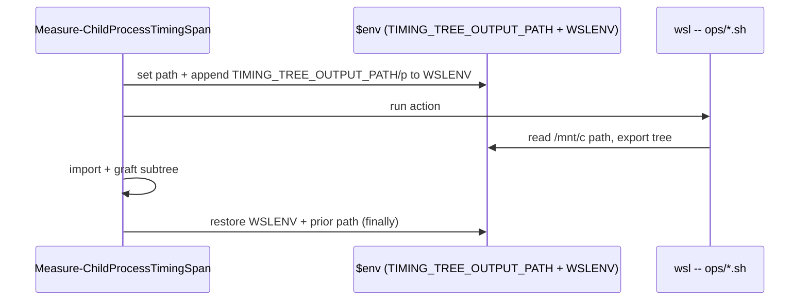

## Cross-process data flow (whole feature)

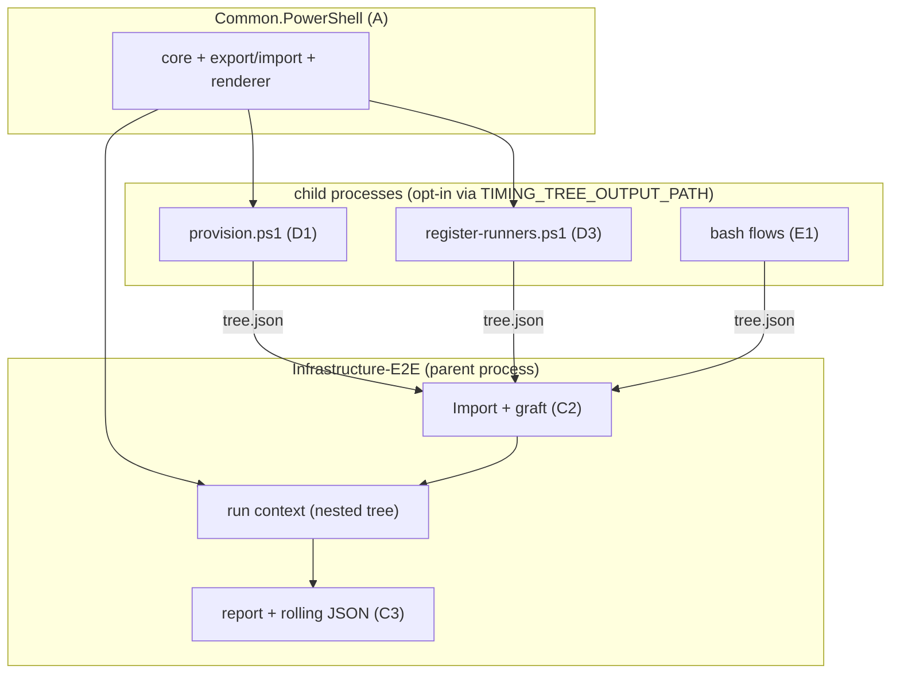
