# Feature 88 - Implementation plan

Design and rationale live in [problem.md](problem.md). This file lists the
ordered, committable steps only. Steps do not repeat context already in
`problem.md`; they link to it.

## Index

- [Conventions](#conventions)
- [Section A - Shared N-level primitive (Common.PowerShell)](#section-a---shared-n-level-primitive-commonpowershell)
  - [A1. Nested-tree core model + accumulation](#a1-nested-tree-core-model--accumulation)
  - [A2. JSON export / import (cross-process handoff)](#a2-json-export--import-cross-process-handoff)
  - [A3. N-level console report renderer](#a3-n-level-console-report-renderer)
  - [A4. Re-express the 2-level verbs as shims](#a4-re-express-the-2-level-verbs-as-shims)
  - [A5. Version gate + consumer pins](#a5-version-gate--consumer-pins)
- [Section B - Provisioner emits its tree (Vm-Provisioner)](#section-b---provisioner-emits-its-tree-vm-provisioner)
  - [B1. Consume the shared module (drop local timing copies)](#b1-consume-the-shared-module-drop-local-timing-copies)
  - [B2. Export tree on the env-var opt-in](#b2-export-tree-on-the-env-var-opt-in)
- [Section C - GitHubRunners emits its tree (GitHubRunners)](#section-c---githubrunners-emits-its-tree-githubrunners)
  - [C1. Instrument + export register/deregister-runners.ps1](#c1-instrument--export-registerderegister-runnersps1)
- [Section D - E2E orchestration + merge + report (Infrastructure-E2E)](#section-d---e2e-orchestration--merge--report-infrastructure-e2e)
  - [D1. Instrument the runner-lifecycle tree](#d1-instrument-the-runner-lifecycle-tree)
  - [D2. Graft child-process trees under their parts](#d2-graft-child-process-trees-under-their-parts)
  - [D3. Emit report + rolling JSON artifact with retention](#d3-emit-report--rolling-json-artifact-with-retention)
  - [D4. README](#d4-readme)
- [Section E - Bash depth tier (last)](#section-e---bash-depth-tier-last)
  - [E1. Bash timing emitter + wire into the bash flows](#e1-bash-timing-emitter--wire-into-the-bash-flows)
- [Cross-process data flow (whole feature)](#cross-process-data-flow-whole-feature)

## Conventions

- Each step is one commit. Tests listed under a step ship in the same
  commit. Lint (`lint-shell` / `lint-yaml` / PSScriptAnalyzer) and the
  relevant test suite must be green before the step is considered done.
- New public functions get a neutral, framework-scoped verb-noun name; the
  final names below are proposals settled during execution.
- Manifest wiring ships with the function. A step that adds a
  `Common.PowerShell/Public/` function also dot-sources it in the psm1 and
  lists it (alphabetically) in both `FunctionsToExport` and
  `Export-ModuleMember`, because the shared `Module.Tests` fails on any
  un-exported `Public\*.ps1`. The `ModuleVersion` bump, `CHANGELOG`
  promotion, and consumer `RequiredModules` pins are a separate release
  gate handled once in A5.
- Coverage is collected on every PowerShell test run and reported in
  totality and per project, per CLAUDE.md.

## Section A - Shared N-level primitive (Common.PowerShell)

The generalisation of the existing 2-level framework (see
[Current state](problem.md#current-state)) into an arbitrary-depth nested
tree, living in `Common.PowerShell/Common.PowerShell/Public/`.

### A1. Nested-tree core model + accumulation

**What.** Add the in-memory model and the primary timing verb:

- `New-TimingSpanTree -RootName <string>` - creates a root node and returns
  a context object that owns the tree + a current-node stack.
- `Measure-TimingSpan -Tree <ctx> -Name <string> -Action <sb>` - find-or-
  create a child named `Name` under the current node, push it, time
  `-Action`, accumulate `ElapsedMs`, set terminal `Status`
  (`OK`/`Failed`, sticky-Failed), pop. Exceptions propagate (observe, do
  not swallow) exactly like `Invoke-WithPhaseTimer` today.
- `Add-TimingSpanDuration -Tree <ctx> -Name <string> -ElapsedMs <int64>
  [-Failed]` - the measure-less primitive for callers that already have an
  elapsed value (mirrors `Add-SubStepDuration`).
- `Initialize-TimingSpanTree -Tree <ctx> -Skeleton <nested hashtable[]>` -
  optional pre-declaration so branches that never run render as `SKIPPED`.

Node shape: `{ Order; Name; Status; ElapsedMs; Source; Children }`.
`Source` is an optional tag (e.g. `provision.ps1`) used later by the merge
step. Accumulation is by name-within-parent so a step run once per VM sums,
preserving today's semantics.

The four verbs live under `Common.PowerShell/Public/Timing/` over three
private helpers in `Private/Timing/` (`Resolve-TimingSpanChildNode` mints
nodes and assigns `Order`, `Add-TimingSpanNodeElapsed` accumulates + sets
sticky status, `Add-TimingSpanSkeletonBranch` walks the skeleton) so the
mint / accumulate / declare mechanics have one implementation each. Per the
manifest-wiring convention, this step also exports the four verbs; the
version gate is A5.

**Why.** Arbitrary depth is the core requirement
([What we want](problem.md#what-we-want)); everything else builds on this
model. A context object (not a `$script:` global) lets the E2E parent and
an imported child tree coexist in one process without clobbering shared
state - the current global-variable design cannot.

**Tests** (`Common.PowerShell.Tests`, unit):
- span nesting to 3+ levels places nodes under the correct parent;
- repeated `Measure-TimingSpan` of the same name accumulates elapsed and
  keeps one node;
- a throwing action records partial elapsed, sets `Failed`, and rethrows;
- sticky-Failed: a later success against a Failed node does not clear it;
- pre-declared skeleton branch left un-run stays `NotStarted`;
- `Order` reflects first-contact declaration order across mixed depths.

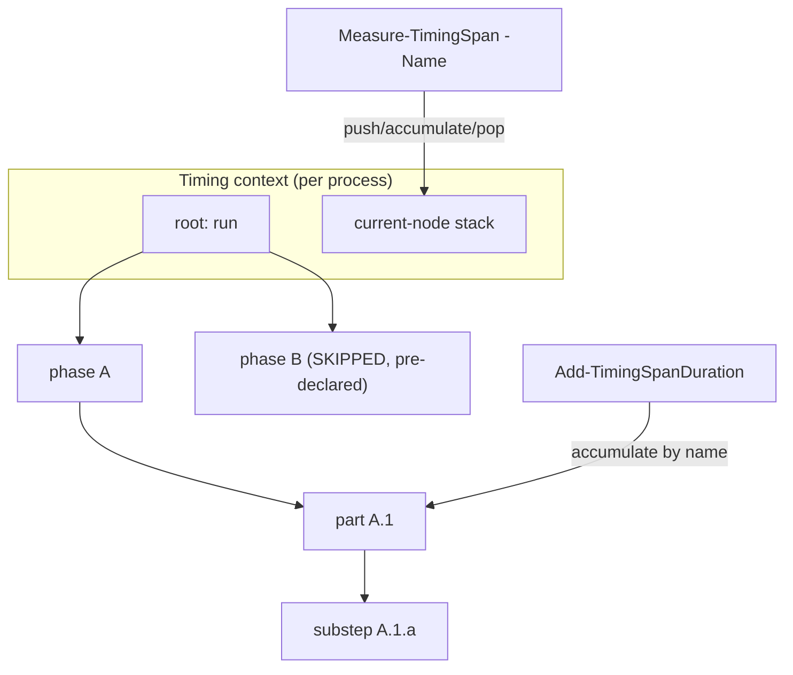

### A2. JSON export / import (cross-process handoff)

**What.** Add:

- `Export-TimingSpanTree -Tree <ctx> -Path <file>` - serialise the tree to
  the versioned nested-JSON shape from
  [Artifact shape decision](problem.md#artifact-shape-decision)
  (`schema: e2e-timing/v1`, `root.children[]`, invariant-culture numbers).
- `Import-TimingSpanTree -Path <file>` - parse a child's export back into a
  node subtree, tolerating a missing or malformed file (returns `$null`
  with a warning; never throws).

**Why.** The process boundary is the central problem
([Motivation](problem.md#motivation)); a serialised tree is how a child
hands its timings to the parent. Import must be defensive so a crashed
child never fails the parent's own report.

**Tests** (unit): round-trip (export then import equals original within
numeric tolerance); schema-version field present; malformed JSON -> `$null`
+ warning, no throw; missing file -> `$null`, no throw.

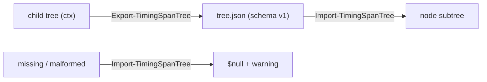

### A3. N-level console report renderer

**What.** `Write-TimingSpanReport -Tree <ctx|node>` - depth-indented
report: per node its `[OK]/[FAILED]/[SKIPPED]` tag, elapsed (invariant
`F2` seconds), and percent-of-parent; a total line for the root. Same
`DarkGreen` single-colour block and column-alignment approach as the
existing `Write-PhaseTimingReport` so it reads consistently.

**Why.** The console report is the primary deliverable
([What we want](problem.md#what-we-want)); it must handle arbitrary depth
and the merged (multi-source) tree, which the 2-level renderer cannot.

**Tests** (unit): a hand-built 4-level tree renders with correct indent and
tags; `%`-of-parent sums sensibly; `SKIPPED`/`FAILED` rows show the dash /
partial elapsed; total counts root only (no double-count).

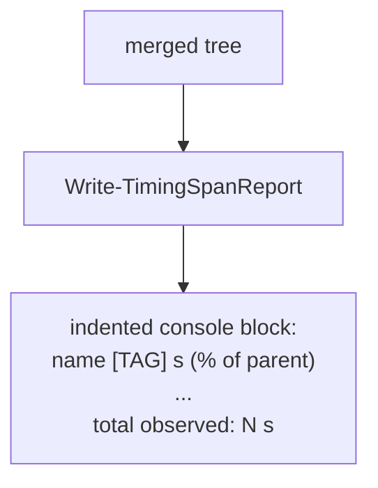

### A4. Re-express the 2-level verbs as shims

**What.** The five 2-level verbs (`Initialize-PhaseTimings`,
`Invoke-WithPhaseTimer`, `Invoke-WithSubStepTimer`, `Add-SubStepDuration`,
`Write-PhaseTimingReport`) live in `Common.PowerShell/Public/Timing/` as thin
wrappers over the A1-A3 core, sharing one module-scoped default context
(`$script:DefaultPhaseTimingTree`) so call sites keep their exact signatures
(no `-Tree` argument):

- `Initialize-PhaseTimings -Phases` mints a fresh default context
  (`New-TimingSpanTree`) and pre-declares it (`Initialize-TimingSpanTree`),
  translating each `@{ Name; SubSteps }` entry into a skeleton `Children`
  branch; re-init clears prior state. It keeps the legacy validation messages
  (empty name / empty sub-step naming the parent).
- `Invoke-WithPhaseTimer -Name` guards the "phase pre-declared" contract
  (throws on an unknown top-level name) then delegates to a depth-1
  `Measure-TimingSpan` on the default context.
- `Invoke-WithSubStepTimer -Parent P -Name` / `Add-SubStepDuration -Parent P`
  resolve the sub-step under the phase node named `P` (not the current-node
  stack), so the legacy "any declared phase is the parent" contract holds
  regardless of call nesting; `Invoke-WithSubStepTimer` is the stopwatch
  wrapper over the measure-less `Add-SubStepDuration`.
- `Write-PhaseTimingReport` renders the default context's 2-level tree in the
  legacy presentation (fixed `=== Provisioning timing report ===` banner, no
  percent column, top-level-only total). It is a distinct renderer, not a call
  to `Write-TimingSpanReport`, because the output must stay byte-identical.

The elapsed-column formatter and the status-tag map are the single authority
for both renderers, extracted to `Private/Timing/Format-TimingSpanElapsed` and
`Private/Timing/Get-TimingSpanStatusTag`.

**Why.** Behaviour-preserving migration
([Constraints](problem.md#constraints-and-non-goals)): `provision.ps1` and
its Pester suite must not change behaviour, and B1 requires the same console
report. Shimming, rather than rewriting call sites, keeps this step small and
low-risk and gives one framework under the hood.

**Tests** (`Common.PowerShell.Tests`, unit): the ported `PhaseTimings` tests -
declaration/order, undeclared-phase and not-initialised throws, sub-step
accumulation, sticky-`Failed`, top-level-only total, and SKIPPED rendering;
structural checks assert against the default context's tree (the tree-model
successor of the old flat `$script:PhaseTimings` list). A 2-level tree built
via the compat verbs renders byte-for-byte as the pre-generalisation report
(pinned-duration snapshot).

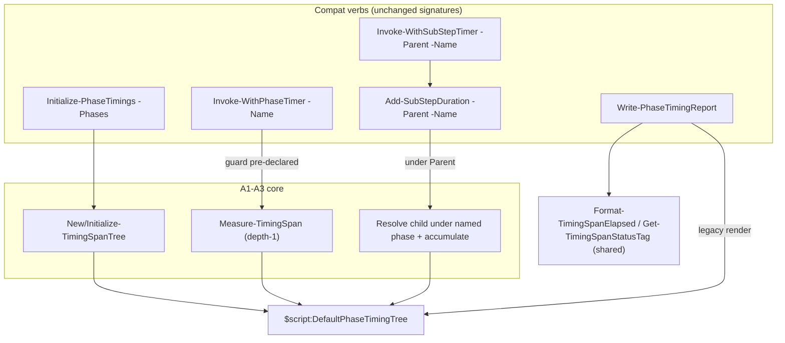

### A5. Version gate + consumer pins

**What.** The per-function manifest exports already ship with A1-A4 (see the
manifest-wiring convention), so this step is the release gate: bump
`ModuleVersion`, promote the accumulated `[Unreleased]` `CHANGELOG` entry to
the new version + date, and update the `RequiredModules` pins in every
consumer that imports the new surface. See the export-intersection and
version-bump gotchas noted in memory.

**Why.** The release CI gate (`check-version-is-new` + assert-changelog) in
`release.yml` / `release-tail.yml` fails a `ModuleVersion` bump without a
matching CHANGELOG promotion, and consumers pinning an older version cannot
resolve the new functions
([Constraints](problem.md#constraints-and-non-goals)).

**Tests**: assert-changelog-version gate green; a smoke import in a clean
session resolves the new functions against the pinned version. (`Module.Tests`
intersection is already green from A1-A4.)

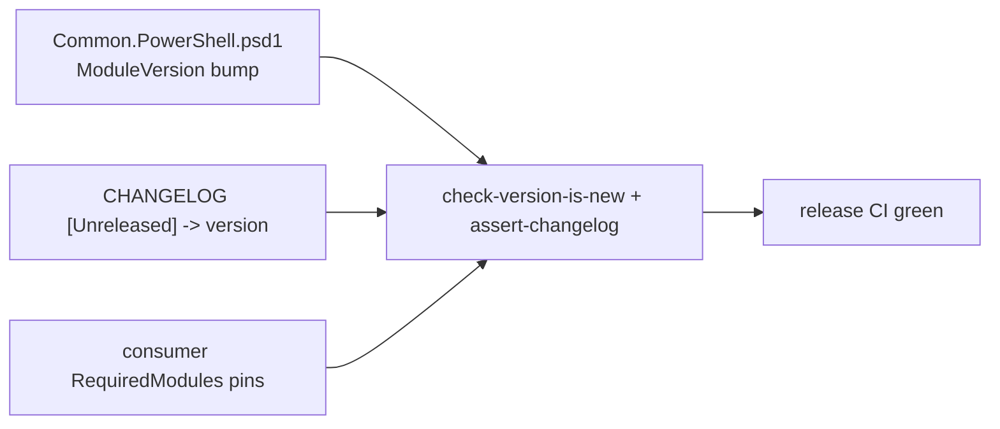

## Section B - Provisioner emits its tree (Vm-Provisioner)

### B1. Consume the shared module (drop local timing copies)

**What.** Replace the five `up/timing/*` dot-sources in `provision.ps1`
with the `Common.PowerShell` import (already present) and delete the local
timing files, making the shared module the single source of truth.

**Why.** SSOT: two copies of the framework would drift. `provision.ps1`
already imports `Common.PowerShell`, so this is a delete + path change.

**Tests**: provisioner PowerShell suite green (timing behaviour unchanged);
a provision dry-run still prints the same phase report.

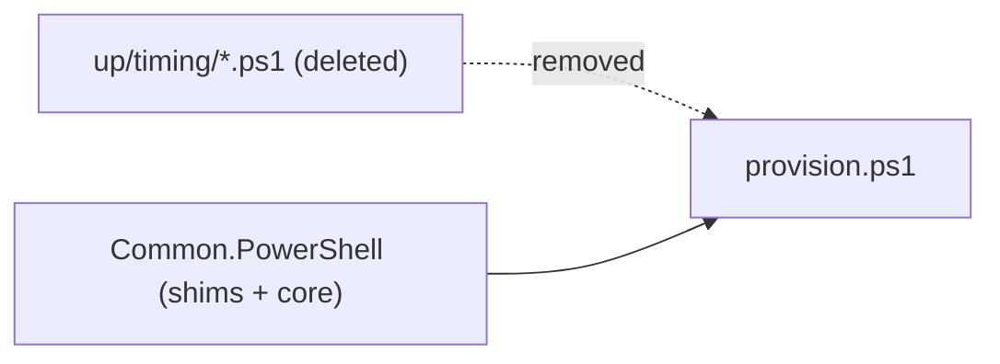

### B2. Export tree on the env-var opt-in

**What.** At the end of `provision.ps1`'s outer `try/finally` (where
`Write-PhaseTimingReport` already runs), when
`$env:TIMING_TREE_OUTPUT_PATH` is set, also call `Export-TimingSpanTree` to
that path - on success AND failure. When unset, behaviour is unchanged
(console report only). Neutral variable name; the script does not know who
consumes it. See
[cross-process handoff](problem.md#resolved-decisions).

**Why.** This is the child half of the process-boundary bridge, kept
test-agnostic (production stays E2E-unaware, per memory).

**Tests** (unit): with the env var set, provision writes a schema-valid
JSON at the path; the failure path still writes; with the env var unset, no
file is written and the console report is unchanged.

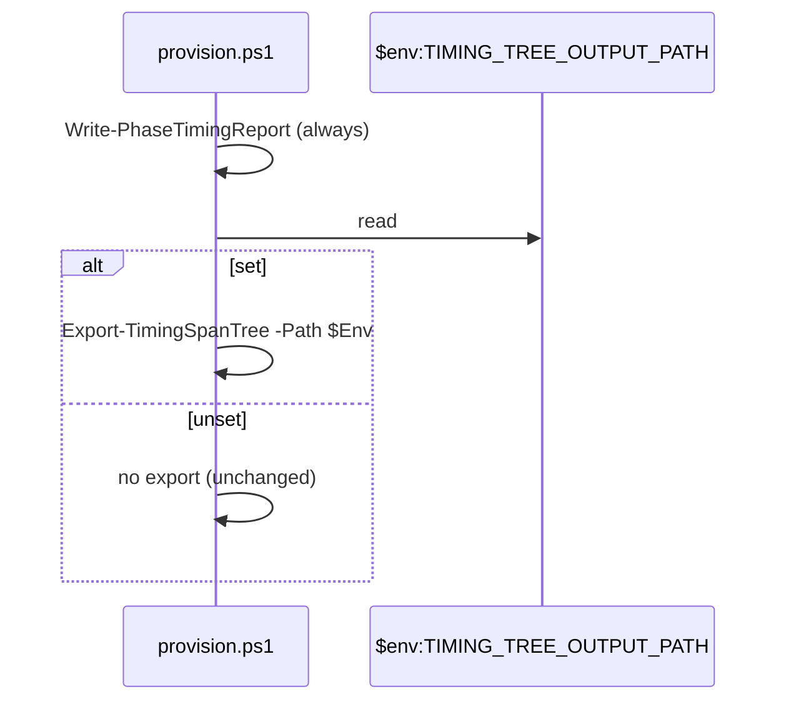

## Section C - GitHubRunners emits its tree (GitHubRunners)

### C1. Instrument + export register/deregister-runners.ps1

**What.** Wrap the meaningful stages of `register-runners.ps1` (and
`deregister-runners.ps1`) in `Invoke-WithPhaseTimer`/`Invoke-WithSubStepTimer`
(or the core verbs) via the shared module, and export on the same
`TIMING_TREE_OUTPUT_PATH` opt-in as B2.

**Why.** Runner registration is a distinct phase of the E2E run and a
plausible time sink ([What we want](problem.md#what-we-want)); without this
it stays an opaque single part.

**Tests** (unit): stages recorded under the expected names; export written
when the env var is set; unset path unchanged.

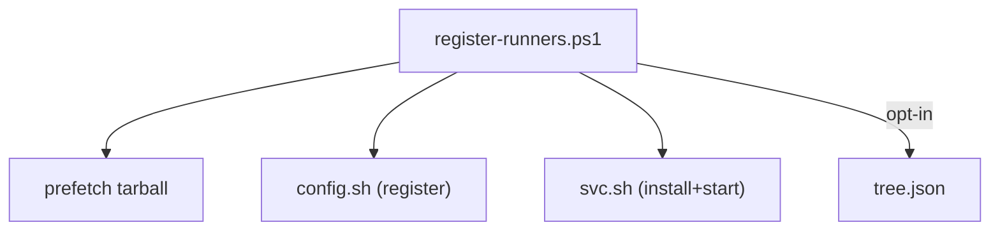

## Section D - E2E orchestration + merge + report (Infrastructure-E2E)

### D1. Instrument the runner-lifecycle tree

**What.** In `Invoke-RunnerLifecycleTest` and the functions it calls
(`Invoke-RunnerLifecycleSetup`, `Invoke-VmUsersSetup`, the phase 2/3 and
assertion helpers, teardown), create the run context and wrap each phase
and part with `Measure-TimingSpan`. Thread the context (not a global) down
the call tree. Parts that shell out (provision/register/users) are wrapped
as one span here; their internals arrive via D2.

**Why.** This produces the phase/part breakdown that is the whole point
([Summary](problem.md#summary)).

**Tests** (unit, with the shell-outs mocked): a full mocked run yields a
tree whose phase and part node names match the expected orchestration
shape; a mid-run failure still yields a tree up to the failure with the
failing span marked `Failed`.

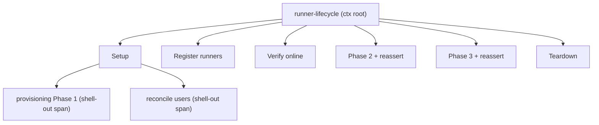

### D2. Graft child-process trees under their parts

**What.** For each shell-out part, set `TIMING_TREE_OUTPUT_PATH` to a fresh
per-invocation temp file before the call, and after it returns
`Import-TimingSpanTree` and attach the imported subtree as the children of
that part's span; delete the temp file. Missing/corrupt child JSON leaves
the part timed with no children (graceful, per A2).

**Why.** This is the "full depth" join
([What we want](problem.md#what-we-want)) - it turns an opaque 8-minute
"provisioning Phase 1" into its VM-boot / JDK-install / wait-for-SSH
breakdown.

**Tests** (unit): a stubbed child export is grafted under the correct part
node; absent child file -> part has zero children and no error; the temp
file is cleaned up.

```mermaid
sequenceDiagram
  participant E2E as E2E part span
  participant Env as temp TIMING_TREE_OUTPUT_PATH
  participant Child as provision.ps1
  E2E->>Env: set fresh temp path
  E2E->>Child: & provision.ps1
  Child->>Env: Export-TimingSpanTree
  E2E->>Env: Import-TimingSpanTree
  E2E->>E2E: graft subtree under part; delete temp
```

### D3. Emit report + rolling JSON artifact with retention

**What.** In the run's outer `finally` (so it fires on success, failure,
and best-effort-cleanup paths): call `Write-TimingSpanReport` for the
console block, then `Export-TimingSpanTree` to
`<diagnostics-root>/timing/<timestamp>.json`, then
`Limit-RetainedItem -Directory <...>/timing -Filter '*.json' -MaxItems N
-FileOnly` to prune old artifacts. See
[artifact location](problem.md#resolved-decisions).

**Why.** Delivers the on-failure-too report and the rolling machine-
readable artifact ([What we want](problem.md#what-we-want)); retention
reuses the existing `Limit-RetainedItem` rather than a new pruner.

**Tests** (unit): report emitted on both success and failure paths; JSON
artifact written under `timing/`; with `MaxItems` exceeded, oldest files
pruned and newest kept.

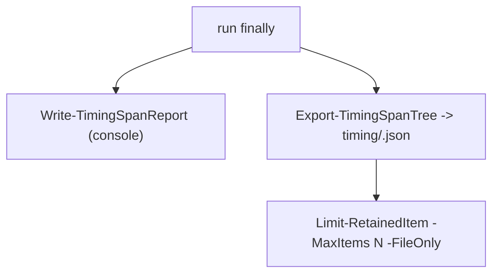

### D4. README

**What.** Document the timing report and artifact in the E2E README (what
it shows, where the JSON lands, the retention knob, the
`TIMING_TREE_OUTPUT_PATH` opt-in). Update the section index.

**Why.** House rule: docs earned per feature, kept navigable.

**Tests**: n/a (docs); markdown index links valid.

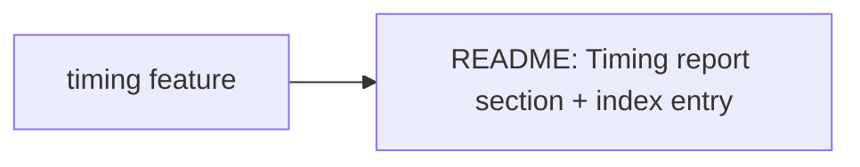

## Section E - Bash depth tier (last)

### E1. Bash timing emitter + wire into the bash flows

**What.** A small POSIX-sh emitter (in `Common-Automation/scripts`, next to
`log.sh`) that records named spans and writes the same nested JSON schema
to `TIMING_TREE_OUTPUT_PATH`. Wire it into `register-runners.sh`,
`provision-toolchains.sh`, and `create-users.sh` so the ansible-flow parts
gain sub-step depth instead of being a single part. Sequenced last per the
[PowerShell-first decision](problem.md#resolved-decisions).

**Why.** Completes full depth for the ansible flows; deferred so the
PowerShell breakdown ships first and proves the schema.

**Tests** (bats): emitter writes schema-valid JSON; spans nest; a flow with
the env var unset behaves exactly as today (no file, no output change).

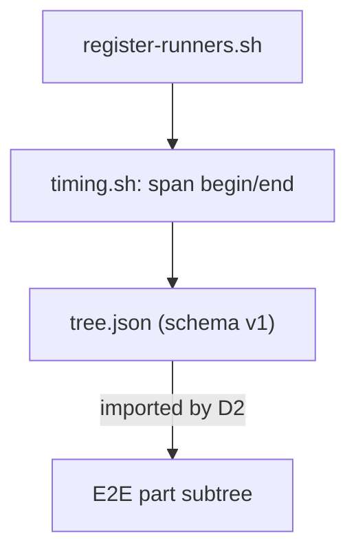

## Cross-process data flow (whole feature)

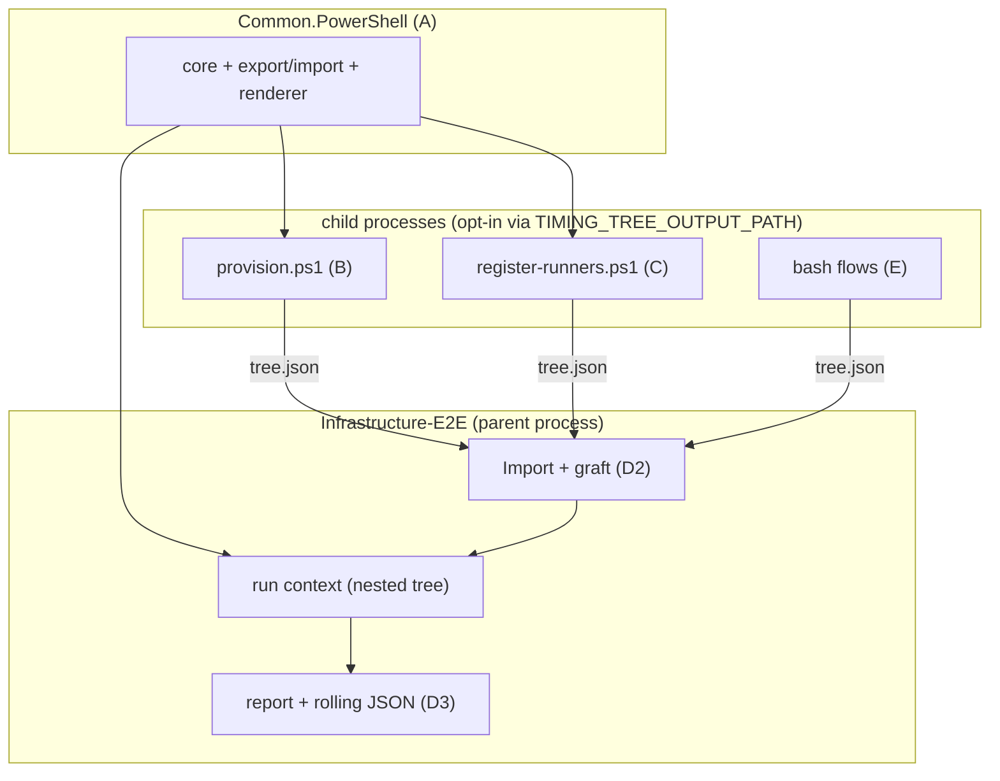
